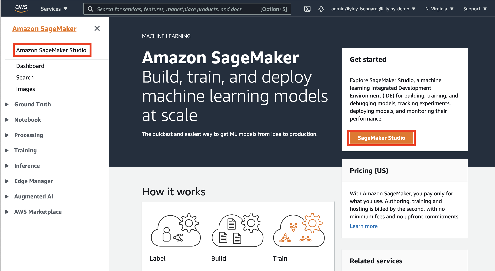

# Amazon SageMaker reusable components
This solution shows how to deliver reusable and managed components to [Amazon SageMaker](https://aws.amazon.com/pm/sagemaker) environment using [AWS Service Catalog](https://aws.amazon.com/servicecatalog/), [SageMaker Projects](https://docs.aws.amazon.com/sagemaker/latest/dg/sagemaker-projects-whatis.html) and [SageMaker Pipelines](https://aws.amazon.com/sagemaker/pipelines/).

## Introduction
Amazon SageMaker helps data scientists and developers to prepare, build, train, and deploy high-quality machine learning models quickly by bringing together a broad set of capabilities purpose-built for machine learning.

[Amazon SageMaker Studio](https://aws.amazon.com/sagemaker/studio/) is a web-based, integrated development environment (IDE) for machine learning (ML) that lets you build, train, debug, deploy, and monitor your ML models.

To implement reusable, reproducible, and governed custom components in your SageMaker environment, you can use a SageMaker Project. A SageMaker project is a self-sufficient end-to-end ML component, which can be instantiated and used by the entitled users of SageMaker Studio. A project is delivered and provisioned via AWS Service Catalog and contains all resources, artifacts, source code, and permissions, which are needed to perform a designated task or a whole workflow in your SageMaker environment.

You can provision a SageMaker project directly in Studio IDE or via [SageMaker API](https://docs.aws.amazon.com/sagemaker/latest/APIReference/API_CreateProject.html). The provisioning happens under a designated IAM role, which assumed by AWS Service Catalog and contains permission specifically needed to perform project template deployment. The Service Catalog-based approach allows you and your ML team to provision any custom ML components and workflows centrally without requiring each ML user to have high-profile permission policies or going via a manual and non-reproducible individual deployment process.

By implementing custom reusable components in with SageMaker projects, you can separate the development, testing, and deployment process for ML components from their employment. 

This solution shows step-by-step how to author and employ such a reusable component on example of a specific ML use case.

## Use case
As an example of an ML workflow, delivered as a [custom SageMaker Project](https://docs.aws.amazon.com/sagemaker/latest/dg/sagemaker-projects-templates-custom.html), we take a use case of an automated pipeline for data transformation and ingestion into [SageMaker Feature Store](https://aws.amazon.com/sagemaker/feature-store/). This workflow combines various AWS services and SageMaker components, such as [AWS Lambda](https://aws.amazon.com/lambda/), [SageMaker Pipelines](https://aws.amazon.com/sagemaker/pipelines/), [AWS CodePipeline](https://aws.amazon.com/codepipeline/), and [AWS CodeBuild](https://aws.amazon.com/codebuild/) to create a self-contained ML component, which you can directly use in your own solution or architecture.

The following diagram shows the functional view of the workflow.


On a high level, the workflow comprises the following steps:
1. Data file or files uploaded to an Amazon S3 bucket
1. Data processing and transformation is launched 
1. Extracted, processed, and transformed features are ingested into a designated feature group in Feature Store

## Solution architecture


## Authoring of SageMaker project template

### Service Catalog portfolio

### Project CloudFormation template

### Project seed code

### IAM roles and permissions

### Project live cycle

## Deployment
Clone the solution [GitHub repository](https://github.com/aws-samples/amazon-sagemaker-reusable-components) to your local development environment:
```sh
git clone https://github.com/aws-samples/amazon-sagemaker-reusable-components.git
cd amazon-sagemaker-reusable-components
```

### Create SageMaker Studio
If you don't have SageMaker Studio created and configured in your account, you must [create a new instance of Studio](https://docs.aws.amazon.com/sagemaker/latest/dg/gs-studio-onboard.html). If you already have Studio, you can continue from [Deploy SageMaker project portfolio](#deploy-sagemaker-project-portfolio) step.
1. Open [Amazon SageMaker Console](https://console.aws.amazon.com/sagemaker/)
1. Select **Amazon SageMaker Studio**:

1. In the configuration dialog select **Standard setup**, **AWS Identity and Access Management (IAM)** and make sure **SageMaker Projects and JumpStart** enabled for the account and Studio users:

Select **Create a new role** in **Permission** configuration. Review, amend if needed, and accept the permissions for the Studio IAM role:

1. In the **Network and storage** configuration select VPC and Network Access for Studio. If you select the **VPC only** option, make sure your VPC has internet access:

1. Click **Submit**

❗ You don't need to wait until Studio becomes available and can move on to the next deployment step.

### Deploy SageMaker project portfolio
This solution includes a [SageMaker custom project template](https://docs.aws.amazon.com/sagemaker/latest/dg/sagemaker-projects-templates-custom.html) to demonstrate the usage of re-usable governed components in Studio, more specifically for automation of feature transformation and ingestion into the [SageMaker Feature Store](https://aws.amazon.com/sagemaker/feature-store/). This project template is delivered as [AWS Service Catalog](https://aws.amazon.com/servicecatalog/) product and available for usage in Studio **Components and registries** menu under **Projects**.

You must follow the following deployment steps to provision all necessary artifacts before starting Studio:

1. [Package CloudFormation templates](package-cfn.md)
1. Get the ARN of the SageMaker execution role:  
    a. Get the SageMaker DomainId:
    ```sh
    export SM_DOMAIN_ID=$(aws sagemaker list-domains \
        --output text --query 'Domains[].DomainId')
    ```
    b. Get the SageMaker execution role ARN:
    ```sh
    export SM_EXECUTION_ROLE=$(aws sagemaker describe-domain \
        --domain-id $SM_DOMAIN_ID \
        --output text --query 'DefaultUserSettings.ExecutionRole')
    ```
1. Deploy AWS Service Catalog product portfolio:
```sh
S3_BUCKET_NAME=<S3 bucket name you used to package CloudFormation templates in step 1>
STACK_NAME=sm-project-sc-portfolio

aws cloudformation create-stack \
    --template-url https://s3.$AWS_DEFAULT_REGION.amazonaws.com/$S3_BUCKET_NAME/amazon-sagemaker-reusable-components/sm-project-sc-portfolio.yaml \
    --region $AWS_DEFAULT_REGION \
    --stack-name $STACK_NAME  \
    --disable-rollback \
    --parameters \
        ParameterKey=SCPortfolioPrincipalRoleArn,ParameterValue=$SM_EXECUTION_ROLE
```

Wait until CloudFormation stack successfully deployed into your account and proceed with the next step.

### Add permissions to Service Catalog launch IAM role
AWS Service Catalog uses a default [`AmazonSageMakerServiceCatalogProductsLaunchRole` IAM role](https://docs.aws.amazon.com/sagemaker/latest/dg/security-iam-awsmanpol-sc.html) to launch CloudFormation templates with SageMaker projects. This role is automatically created during provisioning of SageMaker Studio.

To deploy our Feature Store ingestion product as a SageMaker project, this role needs additional permissions. The all needed permissions are defined in a [managed policy](cfn-templates/sm-sc-policies.yaml), which we must attach to 
 `AmazonSageMakerServiceCatalogProductsLaunchRole` role before we can start SageMaker project deployment.
First, deploy the managed policy via the provided CloudFormation template:
```sh
aws cloudformation deploy \
    --template-file cfn-templates/sm-sc-policies.yaml \
    --stack-name sagemaker-sc-policies \
    --capabilities CAPABILITY_NAMED_IAM
```

Secondly, attach the created managed policy to the `AmazonSageMakerServiceCatalogProductsLaunchRole` role.  
Retrieve the managed policy ARN:
```sh
export SM_SC_FS_INGESTION_POLICY_ARN=$(aws cloudformation describe-stacks \
    --stack-name "sagemaker-sc-policies" \
    --output text \
    --query 'Stacks[0].Outputs[?OutputKey==`FSIngestionProductPolicyArn`].OutputValue')
```

Attach the policy to the role:
```sh
aws iam attach-role-policy \
    --role-name AmazonSageMakerServiceCatalogProductsLaunchRole \
    --policy-arn $SM_SC_FS_INGESTION_POLICY_ARN
```

### Start Studio
To launch Studio you must go to [SageMaker Dashboard](https://console.aws.amazon.com/sagemaker/home?#/dashboard), click **Open SageMaker Studio** and check that **Status** is `Ready`. 
Make sure that Amazon SageMaker project templates are enabled for your account and Studio users in **Studio Summary** pane:


If projects are disabled, click on **Edit Settings**:


and enable the projects in the settings window, click Submit:


If you don't have a studio user, click on the **Add user** in the SageMaker Studio Control panel. Otherwise click on **Open Studio**.


To add a new studio user, enter the corresponding SageMaker execution role which was created in the step [Create SageMaker Studio](#create-sagemaker-studio) in the Add user panel and click Submit:


After a user profile created, you can click on **Open Studio** link. You will be redirected to a new browser window with Studio IDE.


Wait until Studio finishes creation of a default JupyterServer application:


and you presented with Launcher landing page:


### Clone code repository
To use the provided notebooks you must clone the source code repository into your Studio environment.
Open a system terminal in Studio in the **Launcher** window:


Run the following command in the terminal:
```sh
git clone https://github.com/aws-samples/amazon-sagemaker-reusable-components.git
```

The code repository will be downloaded and saved in your home directory in Studio.
Now go to the file browser and open [00-setup](notebooks/00-setup.ipynb) notebook:


The first start of the notebook kernel on a new KernelGateway app takes about 5 minutes. Continue with further instructions in the notebook after Kernel is ready.

---

## Solution walk-through
Please use the provided [setup](notebooks/00-setup.ipynb) and [feature-store-ingest-pipeline](notebooks/01-feature-store-ingest-pipeline.ipynb) notebooks to run all solution steps.

# Dataset
We use a well-known [Abalone dataset](https://www.csie.ntu.edu.tw/~cjlin/libsvmtools/datasets/regression.html#abalone) in this solution. The dataset contains 4177 rows of data, and 8 features.

Dua, D. and Graff, C. (2019). UCI Machine Learning Repository [http://archive.ics.uci.edu/ml]. Irvine, CA: University of California, School of Information and Computer Science.

You can download the dataset from [UCI website](http://archive.ics.uci.edu/ml/datasets/Abalone):
```
wget -t inf http://archive.ics.uci.edu/ml/machine-learning-databases/abalone/abalone.data
wget -t inf http://archive.ics.uci.edu/ml/machine-learning-databases/abalone/abalone.names
```

The copy of the dataset is also available in the project folder [`dataset`](dataset/abalone.data).

# Resources
- [Automate a centralized deployment of Amazon SageMaker Studio with AWS Service Catalog](https://aws.amazon.com/blogs/machine-learning/automate-a-centralized-deployment-of-amazon-sagemaker-studio-with-aws-service-catalog/)
- [Create Amazon SageMaker projects with image building CI/CD pipelines](https://aws.amazon.com/blogs/machine-learning/create-amazon-sagemaker-projects-with-image-building-ci-cd-pipelines/)