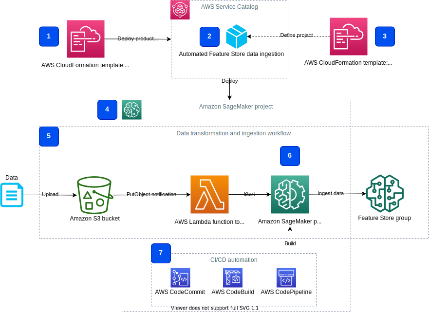
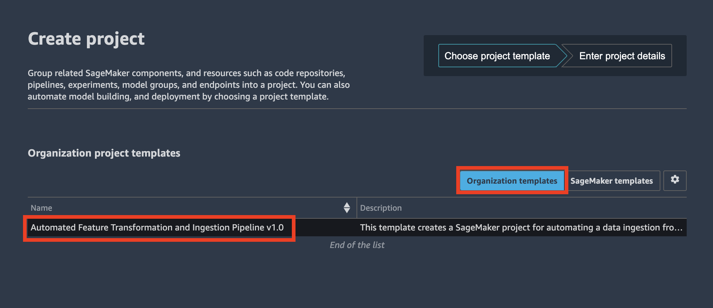
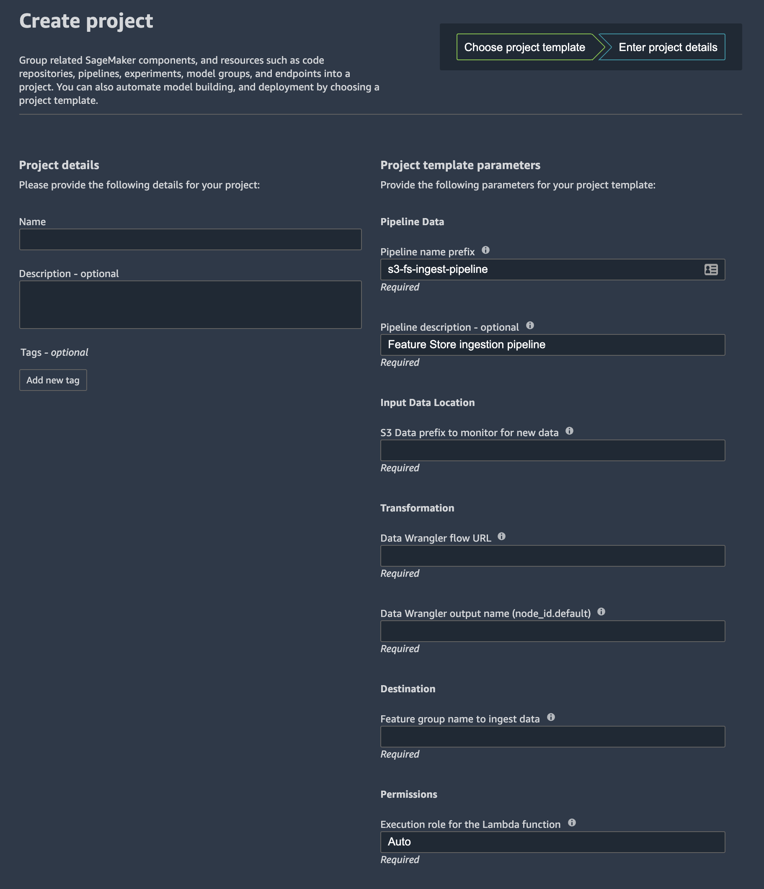
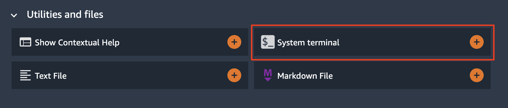

# Amazon SageMaker reusable components with SageMaker Projects
This solution shows how to deliver reusable and self-contained custom components to [Amazon SageMaker](https://aws.amazon.com/pm/sagemaker) environment using [AWS Service Catalog](https://aws.amazon.com/servicecatalog/), [AWS CloudFormation](https://aws.amazon.com/cloudformation/), [SageMaker Projects](https://docs.aws.amazon.com/sagemaker/latest/dg/sagemaker-projects-whatis.html) and [SageMaker Pipelines](https://aws.amazon.com/sagemaker/pipelines/).

## Introduction
Amazon SageMaker helps data scientists and developers to prepare, build, train, and deploy high-quality machine learning models quickly by bringing together a broad set of capabilities purpose-built for machine learning.

[Amazon SageMaker Studio](https://aws.amazon.com/sagemaker/studio/) is a web-based, integrated development environment (IDE) for machine learning (ML) that lets you build, train, debug, deploy, and monitor your ML models.

To implement reusable, reproducible, and governed custom components in your SageMaker environment, you can use a SageMaker project. A SageMaker project is a self-sufficient end-to-end ML component, which can be instantiated and used by the entitled users of SageMaker Studio. A project is delivered and provisioned via AWS Service Catalog and contains all resources, artifacts, source code, and permissions, which are needed to perform a designated task or a whole workflow in your SageMaker environment.

You can provision a SageMaker project directly in Studio IDE or via [SageMaker API](https://docs.aws.amazon.com/sagemaker/latest/APIReference/API_CreateProject.html). The provisioning happens under a designated [AWS Identity and Access Management](https://aws.amazon.com/iam/) (IAM) role, which assumed by AWS Service Catalog and contains permission specifically needed to perform project template deployment and creation of resources. The Service Catalog-based approach allows you and your ML team to provision any custom ML components and workflows centrally without requiring each ML user to have high-profile permission policies or going via a manual and non-reproducible individual deployment process.

By implementing custom reusable components in with SageMaker projects, you can separate the development, testing, and deployment process for ML components from their employment, and follow the best MLOps practices.

This solution shows step-by-step how to author and employ such a reusable component on example of a specific ML use case.

## Use case
As an example of an ML workflow, delivered as a [custom SageMaker project](https://docs.aws.amazon.com/sagemaker/latest/dg/sagemaker-projects-templates-custom.html), we take a use case of an automated pipeline for data transformation and ingestion into [SageMaker Feature Store](https://aws.amazon.com/sagemaker/feature-store/) (FS). This workflow combines various AWS services and SageMaker components, such as [AWS Lambda](https://aws.amazon.com/lambda/), [SageMaker Pipelines](https://aws.amazon.com/sagemaker/pipelines/), [AWS CodePipeline](https://aws.amazon.com/codepipeline/), and [AWS CodeBuild](https://aws.amazon.com/codebuild/) to deliver a self-contained ML component, which you can directly use in your own solution or architecture.

The following diagram shows the functional view of the workflow.


On a high level, the workflow comprises the following steps:
1. An upstream data ingestion component uploads data file or files to an Amazon S3 bucket
2. The data upload event launches a data processing and transformation process
3. The data transformation process extracts, processes, and transforms features, and ingests them into a designated [feature group](https://docs.aws.amazon.com/sagemaker/latest/dg/feature-store-getting-started.html) in Feature Store

## Solution architecture
The detailed component architecture of the solution is presented in the following diagram.



The _Automated FS data ingestion component_ **(1)** is delivered as part of a broader product portfolio **(2)**, which can contain multiple products. In this solution we have only one product in the portfolio. Both the product (1) and the product portfolio (2) are defined by AWS CloudFormation templates. A CloudFormation template **(3)** with the product contains all resources, artifacts, and permissions, which are needed to provision the product in your SageMaker environment.

By the deployment of the product via AWS CloudFormation service, a new SageMaker project **(4)** is created in SageMaker environment. You can see all project artifacts and resources in Studio IDE in **Projects** widget.

The SageMaker project implements the feature ingestion workflow **(5)**. The workflow contains a Lambda function, which is launched by [Amazon EventBridge](https://aws.amazon.com/eventbridge/) rule each time a new object is uploaded into a monitored [Amazon Simple Storage Service](https://aws.amazon.com/s3/) (Amazon S3) bucket. The Lambda function starts a SageMaker Pipeline **(6)** which is defined and provisioned as a part of the SageMaker project. The pipeline contains a single step with [Amazon SageMaker Data Wrangler](https://aws.amazon.com/sagemaker/data-wrangler/) processor for data transformation and ingestion into a feature group in SageMaker Feature Store. The pipeline source code is also delivered as a part of the project in an [AWS CodeCommit](https://aws.amazon.com/codecommit/) repository **(7)**.

The following section provides implementation details for each part of the SageMaker project. You can use these instructions and code to develop your own ML component.

## Authoring a SageMaker project template
To get started with a custom SageMaker project, you need the following resources, artifacts, IAM roles and permissions:
- A CloudFormation template which defines a Service Catalog [portfolio](https://docs.aws.amazon.com/servicecatalog/latest/adminguide/what-is_concepts.html)
- A CloudFormation template which defines a SageMaker project
- IAM roles and permissions needed to run your project components and perform project's tasks and workflows
- If your project contains any source code delivered as a part of the project, this code must be also delivered. We refer to this source code as "the seed code"

### Files in this solution
This solution contains all source code needed to create your own custom SageMaker project.
The structure of the code repository is as follows:
- `cfn-templates` folder:
    - [`project-s3-fs-ingestion.yaml`](cfn-templates/project-s3-fs-ingestion.yaml): a CloudFormation template with the SageMaker project
    - [`sm-project-sc-portfolio.yaml`](cfn-templates/sm-project-sc-portfolio.yaml): a CloudFormation template with product portfolio and managed policies with permissions needed to deploy SageMaker projects
- `project-seed-code/s3-fs-ingestion` folder: contains the project seed code including the SageMaker pipeline definition code, build scripts for CodeBuild project, and source code for the Lambda function
- `notebooks` folder: contains SageMaker notebooks to experiment with the project

The following sections describe each part of the project authoring process and gives examples of source code.

### Service Catalog portfolio
An AWS Service Catalog portfolio is delivered as a CloudFormation template, which defines the following resources:
- Portfolio definition
- Product or products definition
- Product to portfolio association for each product
- Portfolio to IAM principle association. This defines which IAM principle or principles are allowed to deploy portfolio products
- Product launch role constraint. This defines which IAM role the CloudFormation service assumes when user provisions the template

To make your project template available in your **Organization templates** list in Studio, you must add the following tag to the product:

```yaml
    Tags:
    - Key: 'sagemaker:studio-visibility'
        Value: 'true'
```

Refer to [Amazon SageMaker documentation](https://docs.aws.amazon.com/sagemaker/latest/dg/sagemaker-projects-templates-custom.html) for more details on custom project templates.

This solution contains a [working example](cfn-templates/sm-project-sc-portfolio.yaml) of a Service Catalog portfolio which contains a single product.

### Project CloudFormation template
A product is a CloudFormation template. Product's template contains all resources, permissions, and artifacts, which are needed to deliver the product's functionality.

For the product to work with SageMaker projects, you must add the following parameters to your product template:

```yaml
  SageMakerProjectName:
    Type: String
    Description: Name of the project
    MinLength: 1
    MaxLength: 32
    AllowedPattern: ^[a-zA-Z](-*[a-zA-Z0-9])*

  SageMakerProjectId:
    Type: String
    Description: Service generated Id of the project.
```

This solution contains a [product template](cfn-templates/project-s3-fs-ingestion.yaml) which creates the following resources:
- An S3 bucket to store CodePipeline artifacts
- A CodeCommit repository with project source code
- An EventBridge rule to launch CodePipeline when project's CodeCommit repository is updated
- A CodeBuild project to build the SageMaker pipeline
- A CodePipeline pipeline to orchestrate a build of the SageMaker pipeline
- A Lambda function to start the SageMaker pipeline whenever a new object is uploaded to the monitored S3 bucket
- An IAM execution role for the Lambda function
- An S3 bucket to keep an [AWS CloudTrail](https://aws.amazon.com/cloudtrail/) log. ❗ We need a CloudTrail log to enable EventBridge notification for object put events on the monitored bucket. We use the CloudTrail-based notification instead of S3 notifications because we don't want to overwrite an existing S3 notification on the monitored bucket
- A CloudTrail log configured to capture `WriteOnly` events on S3 objects under a specified S3 prefix
- An EventBridge rule to launch the Lambda function whenever a new object is uploaded to the monitored S3 bucket. The EventBridge rule pattern monitors the events `PutObject` and `CompleteMultipartUpload`

The project template is self-sufficient and contains all resources needed to implement the data transformation and ingestion pipeline. It also deploys an CI/CD automation pipeline to build the SageMaker pipeline every time there is an update on the source code repository. 

### IAM roles and permissions
To launch and use the SageMaker portfolio of products from AWS Service Catalog you need two IAM roles:
- an IAM role to launch a SageMaker product from AWS Service Catalog
- an IAM role to use resources created by a SageMaker product, such as a CodePipeline pipeline or an EventBridge rule. These resources assume this IAM role to fulfill their tasks. By default, this role is also used to run a SageMaker pipeline, created by the project.

When you enable SageMaker Projects for Studio users, two default IAM roles are created behind the scenes: `AmazonSageMakerServiceCatalogProductsLaunchRole` and `AmazonSageMakerServiceCatalogProductsUseRole`. These roles are global for your AWS account and used by the [SageMaker-provided Project templates](https://docs.aws.amazon.com/sagemaker/latest/dg/sagemaker-projects-templates-sm.html). You can use these roles for your custom SageMaker projects or you can create your own roles with a specific set of IAM permissions suited to your requirements.

Refer to the [AWS Managed Policies for SageMaker projects](https://docs.aws.amazon.com/sagemaker/latest/dg/security-iam-awsmanpol-sc.html) documentation for more details on the default roles.

If you create and assign new IAM roles to resources created by the project provisioning via AWS Service Catalog and CloudFormation, the `AmazonSageMakerServiceCatalogProductsLaunchRole` must have `iam:PassRole` permission for the roles you created. For example, this solution creates an IAM execution role for the Lambda function. [The managed policy](cfn-templates/sm-project-sc-portfolio.yaml) for `AmazonSageMakerServiceCatalogProductsLaunchRole` contains the corresponding permission statement:
```yaml
- Sid: FSIngestionPermissionPassRole
    Effect: Allow
    Action:
    - 'iam:PassRole'
    Resource:
    - !Sub 'arn:aws:iam::${AWS::AccountId}:role/*StartIngestionPipeline*'
```

The following diagram shows all the IAM roles involved and what service or resource assumes what role:


1. The SageMaker Service Catalog products launch role. This role calls `iam:PassRole` API on the SageMaker Service Catalog products use role (2) and the Lambda execution role (4) 
2. The SageMaker Service Catalog products use role
3. The SageMaker execution role. Studio notebooks use this role to access all resources, including S3 buckets
4. The Lambda execution role. The Lambda function assumes this role
5. The Lambda function [resource policy](https://docs.aws.amazon.com/lambda/latest/dg/access-control-resource-based.html) allows EventBridge service to invoke the function

Refer to [SageMaker Studio Permissions Required to Use Projects](https://docs.aws.amazon.com/sagemaker/latest/dg/sagemaker-projects-studio-updates.html) documentation for more details on SageMaker Studio permission setup for Projects.

### Project seed code
If your custom SageMaker project implements CI/CD workflow automation or contains any source code-based resources, you can deliver the seed code as a CodeCommit or a third-party Git repository such as GitHub and Bitbucket. The project user owns the code and can customize it and the configuration files to suit their requirements.

This solution delivers the seed code which contains a SageMaker pipeline definition. A CI/CD workflow as a CodePipeline pipeline is also created as a part of the project. This CodePipeline pipeline is started each time there is a commit to the source code repository.

### Project life cycle
A project goes via distinct life cycle stages: you create a project, you use it and its resources, and you optionally delete the project when you don't need it anymore.

#### Create project
To create a new SageMaker project, go to Studio **SageMaker resources**, and then select **Projects** from the dropdown list, choose **Create project**:


For custom templates, choose **Organization templates**, then choose the project name you want to provision:



Enter name and description of your project in **Project details**, and provide project-specific parameters:



You can also use Python SDK to create a project programmatically, as shown in this code snippet from [`01-feature-store-ingest-pipeline` notebook](notebooks/01-feature-store-ingest-pipeline.ipynb):
```python
sm = boto3.client("sagemaker")

# set project_parameters
# project_parameters = [
#    {
#        'Key': 'PipelineDescription',
#        'Value': 'Feature Store ingestion pipeline'
#    },
#       ...
#]

r = sm.create_project(
    ProjectName=project_name,
    ProjectDescription="Feature Store ingestion from S3",
    ServiceCatalogProvisioningDetails={
        'ProductId': product_id,
        'ProvisioningArtifactId': provisioning_artifact_ids,
        'ProvisioningParameters': project_parameters
    },
)
```

Each project is provisioned via a regular AWS Service Catalog and CloudFormation process. Given you have the corresponding IAM permissions, you can observe the project deployment in [CloudFormation console](https://console.aws.amazon.com/cloudformation/home), browse Stack Info, Events, Resources, Outputs, Parameters, and Template:


#### View project resources
After the project is provisioned, you can browse SageMaker-specific project resources in Studio IDE:


You can also see all resources created by the project deployment process in CloudFormation console.

Any resource created by the project, is tagged automatically with two tags: `sagemaker:project-name` and `sagemaker:project-id`, allowing for data and resource lineage:


You can add your own tags to project resources.

#### Delete project
If you don't need the provisioned project any more, to stop incurring charges, you must delete it to clean up the resources created by the project.

At the time of this writing, there is no possibility to delete a project from Studio IDE. To delete a project, you must use [SageMaker API](https://docs.aws.amazon.com/sagemaker/latest/APIReference/API_DeleteProject.html). A sample python code looks like:
```python
import boto3

sm_client=boto3.client("sagemaker")
sm_client.delete_project(ProjectName="MyProject")
```

The project deletion also initiates the deletion of the CloudFormation stack with the project template.

❗ Please note, a project can create other resources, such as objects in S3 buckets, ML models, feature groups, inference endpoints, or CloudFormation stacks. These resources may not be removed upon project deletion. Refer to a specific project documentation how to perform a full clean up.

This solution provides a [SageMaker Studio notebook](notebooks/99-clean-up.ipynb) to delete all resources created by the project.

## Deployment
To deploy the solution, you must have **Administrator** (or **Power User**) permissions to package the CloudFormation templates, upload templates in your Amazon S3 bucket, and run the deployment commands.

You must also have [AWS CLI](https://aws.amazon.com/cli/). If you do not have it, see [Installing, updating, and uninstalling the AWS CLI](https://docs.aws.amazon.com/cli/latest/userguide/cli-chap-install.html). 

Clone the solution [GitHub repository](https://github.com/aws-samples/amazon-sagemaker-reusable-components.git) to your local development environment:
```sh
git clone https://github.com/aws-samples/amazon-sagemaker-reusable-components.git
cd amazon-sagemaker-reusable-components
```

### Create SageMaker Studio
If you don't have SageMaker Studio created and configured in your account, you must [create a new instance of Studio](https://docs.aws.amazon.com/sagemaker/latest/dg/gs-studio-onboard.html). If you already have Studio, you can continue from [Deploy SageMaker project portfolio](#deploy-sagemaker-project-portfolio) step.
1. Open [Amazon SageMaker Console](https://console.aws.amazon.com/sagemaker/)
1. Select **Amazon SageMaker Studio**:

1. In the configuration dialog select **Standard setup**, **AWS Identity and Access Management (IAM)** and make sure **SageMaker Projects and JumpStart** enabled for the account and Studio users:

Select **Create a new role** in **Permission** configuration. Review, amend if needed, and accept the permissions for the Studio IAM role:

1. In the **Network and storage** configuration select VPC and Network Access for Studio. If you select the **VPC only** option, make sure your VPC has internet access:

1. Click **Submit**

❗ You don't need to wait until Studio becomes available and can move on to the next deployment step.

### Deploy SageMaker project portfolio
This solution includes a [SageMaker custom project template](https://docs.aws.amazon.com/sagemaker/latest/dg/sagemaker-projects-templates-custom.html) to demonstrate the usage of re-usable governed components in Studio, more specifically for automation of feature transformation and ingestion into the [SageMaker Feature Store](https://aws.amazon.com/sagemaker/feature-store/). This project template is delivered as [AWS Service Catalog](https://aws.amazon.com/servicecatalog/) product and available for usage in Studio **SageMaker resources** menu under **Projects**.

You must follow the following deployment steps to provision all necessary artifacts before starting Studio:

1. [Package CloudFormation templates](package-cfn.md)
1. Get the ARN of the SageMaker execution role:  
    a. Get the SageMaker DomainId:
    ```sh
    export SM_DOMAIN_ID=$(aws sagemaker list-domains \
        --output text --query 'Domains[0].DomainId')
    ```
    b. Get the SageMaker execution role ARN:
    ```sh
    export SM_EXECUTION_ROLE=$(aws sagemaker describe-domain \
        --domain-id $SM_DOMAIN_ID \
        --output text --query 'DefaultUserSettings.ExecutionRole')
    ```
1. Deploy AWS Service Catalog product portfolio:
```sh
S3_BUCKET_NAME=<S3 bucket name you used to package CloudFormation templates in step 1>
SC_PORTFOLIO_STACK_NAME=sm-project-sc-portfolio

aws cloudformation create-stack \
    --template-url https://s3.$AWS_DEFAULT_REGION.amazonaws.com/$S3_BUCKET_NAME/amazon-sagemaker-reusable-components/sm-project-sc-portfolio.yaml \
    --region $AWS_DEFAULT_REGION \
    --stack-name $SC_PORTFOLIO_STACK_NAME  \
    --disable-rollback \
    --capabilities CAPABILITY_NAMED_IAM \
    --parameters \
        ParameterKey=SCPortfolioPrincipalRoleArn,ParameterValue=$SM_EXECUTION_ROLE
```

Wait until CloudFormation stack is successfully deployed into your account and proceed with the next step.

### Add permissions to Service Catalog launch and SageMaker execution IAM roles
AWS Service Catalog uses a default [`AmazonSageMakerServiceCatalogProductsLaunchRole` IAM role](https://docs.aws.amazon.com/sagemaker/latest/dg/security-iam-awsmanpol-sc.html) to launch CloudFormation templates with SageMaker projects. This role is automatically created during provisioning of SageMaker Studio if you enable SageMaker Projects for Studio users.

To deploy our Feature Store ingestion product as a SageMaker project, this role needs additional permissions. All needed permissions are defined in a [managed policy resource `AmazonSageMakerServiceCatalogFSIngestionProductPolicy`](cfn-templates/sm-project-sc-portfolio.yaml), which we must attach to 
 `AmazonSageMakerServiceCatalogProductsLaunchRole` role before we can start SageMaker project deployment.  

To run some code cells in the provided notebooks, for example with calls to [CloudFormation API](https://docs.aws.amazon.com/AWSCloudFormation/latest/APIReference/API_Operations.html), the SageMaker execution role needs additional permissions. These permissions are defined in [managed policy resource `AmazonSageMakerExecutionRolePolicy`](cfn-templates/sm-project-sc-portfolio.yaml) and must be attached to the SageMaker execution role.

Run the following CLI commands to attach the created managed policies to the `AmazonSageMakerServiceCatalogProductsLaunchRole` and SageMaker execution IAM roles:  
Retrieve the managed policy ARNs and SageMaker execution role name:
```sh
export SM_SC_FS_INGESTION_POLICY_ARN=$(aws cloudformation describe-stacks \
    --stack-name $SC_PORTFOLIO_STACK_NAME \
    --output text \
    --query 'Stacks[0].Outputs[?OutputKey==`FSIngestionProductPolicyArn`].OutputValue')

export SM_EXECUTION_ROLE_POLICY_ARN=$(aws cloudformation describe-stacks \
    --stack-name $SC_PORTFOLIO_STACK_NAME \
    --output text \
    --query 'Stacks[0].Outputs[?OutputKey==`AmazonSageMakerExecutionRolePolicyArn`].OutputValue')

export SM_EXECUTION_ROLE_NAME=$(aws cloudformation describe-stacks \
    --stack-name $SC_PORTFOLIO_STACK_NAME \
    --output text \
    --query 'Stacks[0].Outputs[?OutputKey==`AmazonSageMakerExecutionRoleName`].OutputValue')
```

Attach the policies to the roles:
```sh
aws iam attach-role-policy \
    --role-name AmazonSageMakerServiceCatalogProductsLaunchRole \
    --policy-arn $SM_SC_FS_INGESTION_POLICY_ARN

aws iam attach-role-policy \
    --role-name  $SM_EXECUTION_ROLE_NAME \
    --policy-arn $SM_EXECUTION_ROLE_POLICY_ARN
```

### Start Studio
To launch Studio you must go to [SageMaker Dashboard](https://console.aws.amazon.com/sagemaker/home?#/dashboard), click **Open SageMaker Studio** and check that **Status** is `Ready`. 
Make sure that Amazon SageMaker project templates are enabled for your account and Studio users in **Studio Summary** pane:


If projects are disabled, click on **Edit Settings**:


and enable the projects in the settings window, click Submit:


If you don't have a studio user, click on the **Add user** in the SageMaker Studio Control panel. Otherwise click on **Open Studio**.


To add a new studio user, enter the corresponding SageMaker execution role which was created in the step [Create SageMaker Studio](#create-sagemaker-studio) in the Add user panel and click Submit:


After a user profile created, you can click on **Open Studio** link. You will be redirected to a new browser window with Studio IDE.


Wait until Studio finishes creation of a default JupyterServer application:


and you presented with Launcher landing page:


### Clone code repository
To use the provided notebooks you must clone the source code repository into your Studio environment.
Open a system terminal in Studio in the **Launcher** window:



Run the following command in the terminal:
```sh
git clone https://github.com/aws-samples/amazon-sagemaker-reusable-components.git
```

The code repository will be downloaded and saved in your home directory in Studio.
Now go to the file browser and open [00-setup](notebooks/00-setup.ipynb) notebook:


The first start of the notebook kernel on a new KernelGateway app takes about 5 minutes. Continue with further instructions in the notebook after Kernel is ready.

## Solution walk-through
Please use the provided [setup](notebooks/00-setup.ipynb) and [feature-store-ingest-pipeline](notebooks/01-feature-store-ingest-pipeline.ipynb) notebooks to run all solution steps.

The delivered notebooks take you through the following implementation:
- [Setup](notebooks/00-setup.ipynb)
    - set up the working environment, create an S3 bucket for data upload, explore the test dataset
    - optional - create a Data Wrangler flow for data transformation and feature ingestion
    - create a feature group in Feature Store where features are stored
    - query the data from the feature group
- [Feature Store ingestion pipeline](notebooks/01-feature-store-ingest-pipeline.ipynb)
    - provision a SageMaker project with a data pipeline
    - explore the project resources
    - test the data pipeline by uploading new data into the monitored S3 bucket
    - run the data pipeline on demand via Python SDK
    - query the data from the feature group
- [Clean up](notebooks/99-clean-up.ipynb)
    - delete the project and project's resources
    - delete the feature group
    - delete project-provisioned S3 buckets and S3 objects

# Clean up
To avoid charges, you must remove all project-provisioned and generated resources from your AWS account. 

1. Run all steps in the provided [clean-up notebook](notebooks/99-clean-up.ipynb)
2. Detach the managed policies from the roles:
```sh
aws iam detach-role-policy \
    --role-name AmazonSageMakerServiceCatalogProductsLaunchRole \
    --policy-arn $SM_SC_FS_INGESTION_POLICY_ARN

aws iam detach-role-policy \
    --role-name  $SM_EXECUTION_ROLE_NAME \
    --policy-arn $SM_EXECUTION_ROLE_POLICY_ARN
```
3. Delete the SageMaker product portfolio stack:
```sh
aws cloudformation delete-stack --stack-name $SC_PORTFOLIO_STACK_NAME
```

# Dataset
We use a well-known [Abalone dataset](https://www.csie.ntu.edu.tw/~cjlin/libsvmtools/datasets/regression.html#abalone) in this solution. The dataset contains 4177 rows of data, and 8 features.

Dua, D. and Graff, C. (2019). UCI Machine Learning Repository [http://archive.ics.uci.edu/ml]. Irvine, CA: University of California, School of Information and Computer Science.

You can download the dataset from [UCI website](http://archive.ics.uci.edu/ml/datasets/Abalone):
```
wget -t inf http://archive.ics.uci.edu/ml/machine-learning-databases/abalone/abalone.data
wget -t inf http://archive.ics.uci.edu/ml/machine-learning-databases/abalone/abalone.names
```

The instructions, how to download and use the dataset, are provided in the [`00-setup` notebook](notebooks/00-setup.ipynb)

# Resources
- [Automate a centralized deployment of Amazon SageMaker Studio with AWS Service Catalog](https://aws.amazon.com/blogs/machine-learning/automate-a-centralized-deployment-of-amazon-sagemaker-studio-with-aws-service-catalog/)
- [Create Amazon SageMaker projects with image building CI/CD pipelines](https://aws.amazon.com/blogs/machine-learning/create-amazon-sagemaker-projects-with-image-building-ci-cd-pipelines/)
- [Create Amazon SageMaker projects using third-party source control and Jenkins
](https://aws.amazon.com/blogs/machine-learning/create-amazon-sagemaker-projects-using-third-party-source-control-and-jenkins/)
- [GitHub public repository for Feature Store workshop](https://github.com/aws-samples/amazon-sagemaker-feature-store-end-to-end-workshop)
- [GitHub public repository for Amazon SageMaker Drift Detection](https://github.com/aws-samples/amazon-sagemaker-drift-detection)
- [Schedule an Amazon SageMaker Data Wrangler flow to process new data periodically using AWS Lambda functions](https://aws.amazon.com/blogs/machine-learning/schedule-an-amazon-sagemaker-data-wrangler-flow-to-process-new-data-periodically-using-aws-lambda-functions/)

# License
This library is licensed under the MIT-0 License. See the [LICENSE](LICENSE) file.

Copyright Amazon.com, Inc. or its affiliates. All Rights Reserved.
SPDX-License-Identifier: MIT-0