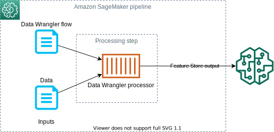
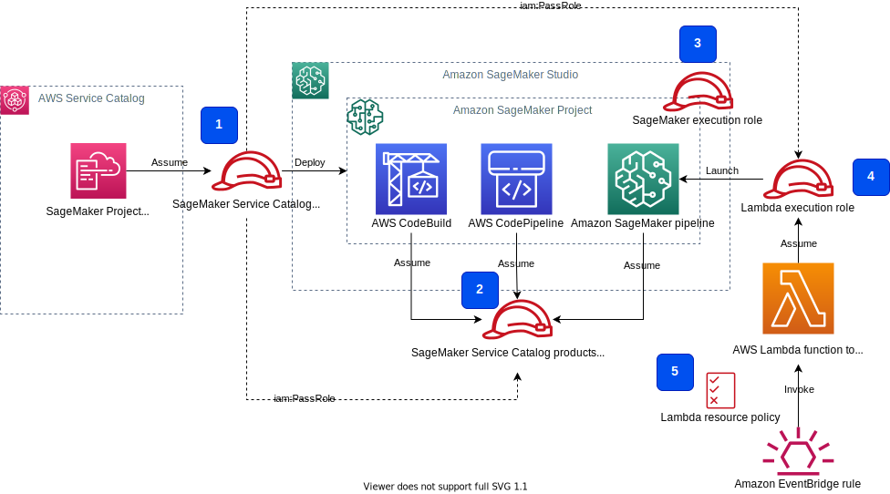
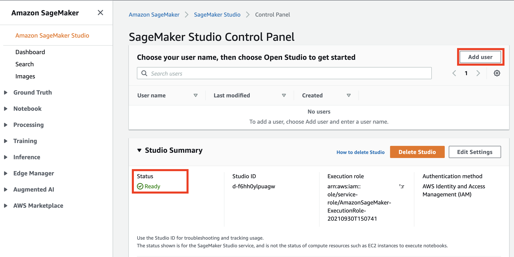

# Amazon SageMaker reusable components with SageMaker Projects
This solution shows how to deliver reusable and self-contained ML components to [Amazon SageMaker](https://aws.amazon.com/pm/sagemaker) environment using [AWS Service Catalog](https://aws.amazon.com/servicecatalog/), [AWS CloudFormation](https://aws.amazon.com/cloudformation/), [SageMaker Projects](https://docs.aws.amazon.com/sagemaker/latest/dg/sagemaker-projects-whatis.html) and [SageMaker Pipelines](https://aws.amazon.com/sagemaker/pipelines/).

Refer to the blog [Enhance your machine learning development by using a modular architecture with Amazon SageMaker projects](https://aws.amazon.com/blogs/machine-learning/enhance-your-machine-learning-development-by-using-a-modular-architecture-with-amazon-sagemaker-projects/) for more details.

## Solution overview
As an example of an ML workflow that spans several development domains, the proposed solution implements a use case of an automated pipeline for data transformation, feature extraction, and ingestion into [Amazon SageMaker Feature Store](https://aws.amazon.com/sagemaker/feature-store/).

On a high level, the workflow comprises the following steps:


1. An upstream data ingestion component uploads data file or files to an [Amazon Simple Storage Service](https://aws.amazon.com/s3/) (Amazon S3) bucket
2. The data upload event launches a data processing and transformation process
3. The data transformation process extracts, processes, and transforms features, and ingests them into a designated [feature group](https://docs.aws.amazon.com/sagemaker/latest/dg/feature-store-getting-started.html) in Feature Store

## Solution architecture
The detailed component architecture of the solution is presented in the following diagram.


A product portfolio **(1)** defines the automated Feature Store data ingestion product **(2)** together with the associated user roles that are allowed to use the portfolio and the containing products. CloudFormation templates define both the product portfolio (1) and the product (2). A CloudFormation template **(3)** contains all the resources, source code, configuration, and permissions that are needed to provision the product in your SageMaker environment.

When AWS CloudFormation deploys the product, it creates a new SageMaker project **(4)**.

The SageMaker project implements the feature ingestion workflow **(5)**. The workflow contains an [AWS Lambda](https://aws.amazon.com/lambda/) function, which is launched by an [Amazon EventBridge](https://aws.amazon.com/eventbridge/) rule each time new objects are uploaded into a monitored S3 bucket. The Lambda function starts an [Amazon SageMaker Pipeline](https://aws.amazon.com/sagemaker/pipelines/) **(6)**, which is defined and provisioned as a part of the SageMaker project. The pipeline implements data transformation and ingestion in Feature Store.

The project also provisions CI/CD automation **(7)** with an [AWS CodeCommit](https://aws.amazon.com/codecommit/) repository with source code, [AWS CodeBuild](https://aws.amazon.com/codebuild/) with a pipeline build script, and [AWS CodePipeline](https://aws.amazon.com/codepipeline/) to orchestrate the build and deployment of the SageMaker pipeline (6).

### ML pipeline
This solution implements an ML pipeline by using Amazon SageMaker Pipelines, an ML workflow creation and orchestration framework. The pipeline contains a single step with an [Amazon SageMaker Data Wrangler](https://aws.amazon.com/sagemaker/data-wrangler/) processor for data transformation and ingestion into a feature group in Feature Store. The following diagram shows a data processing pipeline implemented by this solution.



### IAM roles and permissions
The following diagram shows all the IAM roles involved and which service or resource assumes which role.



The IAM setup contains the following roles:

1. The SageMaker Service Catalog products launch role. This role calls the `iam:PassRole` API for the SageMaker Service Catalog products use role (2) and the Lambda execution role (4).
2. The SageMaker Service Catalog products use role. Project resources assume this role to perform their tasks.
3. The SageMaker execution role. Studio notebooks use this role to access all resources, including S3 buckets.
4. The Lambda execution role. The Lambda function assumes this role.
5. The Lambda function [resource policy](https://docs.aws.amazon.com/lambda/latest/dg/access-control-resource-based.html) allows EventBridge to invoke the function.

Refer to [SageMaker Studio Permissions Required to Use Projects](https://docs.aws.amazon.com/sagemaker/latest/dg/sagemaker-projects-studio-updates.html) for more details on the Studio permission setup for projects.

## Deployment
To deploy the solution, you must have **Administrator** (or **Power User**) permissions to package the CloudFormation templates, upload templates in your Amazon S3 bucket, and run the deployment commands.

You must also have [AWS CLI](https://aws.amazon.com/cli/). If you do not have it, see [Installing, updating, and uninstalling the AWS CLI](https://docs.aws.amazon.com/cli/latest/userguide/cli-chap-install.html). 

Clone the solution [GitHub repository](https://github.com/aws-samples/amazon-sagemaker-reusable-components.git) to your local development environment:
```sh
git clone https://github.com/aws-samples/amazon-sagemaker-reusable-components.git
cd amazon-sagemaker-reusable-components
```

### Create SageMaker Studio
If you don't have SageMaker Studio created and configured in your account, you must [create a new instance of Studio](https://docs.aws.amazon.com/sagemaker/latest/dg/gs-studio-onboard.html). If you already have Studio, you can continue from [Deploy SageMaker project portfolio](#deploy-sagemaker-project-portfolio) step.
1. Open [Amazon SageMaker Console](https://console.aws.amazon.com/sagemaker/)
1. Select **Amazon SageMaker Studio**:

1. In the configuration dialog select **Standard setup**, **AWS Identity and Access Management (IAM)** and make sure **SageMaker Projects and JumpStart** enabled for the account and Studio users:

Select **Create a new role** in **Permission** configuration. Review, amend if needed, and accept the permissions for the Studio IAM role:

1. In the **Network and storage** configuration select VPC and Network Access for Studio. If you select the **VPC only** option, make sure your VPC has internet access:

1. Click **Submit**

❗ You don't need to wait until Studio becomes available and can move on to the next deployment step.

### Deploy SageMaker project portfolio
This solution includes a [SageMaker custom project template](https://docs.aws.amazon.com/sagemaker/latest/dg/sagemaker-projects-templates-custom.html) to demonstrate the usage of re-usable governed components in Studio, more specifically for automation of feature transformation and ingestion into the [SageMaker Feature Store](https://aws.amazon.com/sagemaker/feature-store/). This project template is delivered as [AWS Service Catalog](https://aws.amazon.com/servicecatalog/) product and available for usage in Studio **SageMaker resources** menu under **Projects**.

You must follow the following deployment steps to provision all necessary artifacts before starting Studio:

1. [Package CloudFormation templates](package-cfn.md)
1. Get the ARN of the SageMaker execution role:  
    a. Get the SageMaker DomainId:
    ```sh
    export SM_DOMAIN_ID=$(aws sagemaker list-domains \
        --output text --query 'Domains[0].DomainId')
    ```
    b. Get the SageMaker execution role ARN:
    ```sh
    export SM_EXECUTION_ROLE=$(aws sagemaker describe-domain \
        --domain-id $SM_DOMAIN_ID \
        --output text --query 'DefaultUserSettings.ExecutionRole')
    ```
1. Deploy AWS Service Catalog product portfolio:
```sh
S3_BUCKET_NAME=<S3 bucket name you used to package CloudFormation templates in step 1>
SC_PORTFOLIO_STACK_NAME=sm-project-sc-portfolio

aws cloudformation create-stack \
    --template-url https://s3.$AWS_DEFAULT_REGION.amazonaws.com/$S3_BUCKET_NAME/amazon-sagemaker-reusable-components/sm-project-sc-portfolio.yaml \
    --region $AWS_DEFAULT_REGION \
    --stack-name $SC_PORTFOLIO_STACK_NAME  \
    --disable-rollback \
    --capabilities CAPABILITY_NAMED_IAM \
    --parameters \
        ParameterKey=SCPortfolioPrincipalRoleArn,ParameterValue=$SM_EXECUTION_ROLE
```

Wait until CloudFormation stack is successfully deployed into your account and proceed with the next step.

### Add permissions to Service Catalog launch and SageMaker execution IAM roles
AWS Service Catalog uses a default [`AmazonSageMakerServiceCatalogProductsLaunchRole` IAM role](https://docs.aws.amazon.com/sagemaker/latest/dg/security-iam-awsmanpol-sc.html) to launch CloudFormation templates with SageMaker projects. This role is automatically created during provisioning of SageMaker Studio if you enable SageMaker Projects for Studio users.

To deploy our Feature Store ingestion product as a SageMaker project, this role needs additional permissions. All needed permissions are defined in a [managed policy resource `AmazonSageMakerServiceCatalogFSIngestionProductPolicy`](cfn-templates/sm-project-sc-portfolio.yaml), which we must attach to 
 `AmazonSageMakerServiceCatalogProductsLaunchRole` role before we can start SageMaker project deployment.  

To run some code cells in the provided notebooks, for example with calls to [CloudFormation API](https://docs.aws.amazon.com/AWSCloudFormation/latest/APIReference/API_Operations.html), the SageMaker execution role needs additional permissions. These permissions are defined in [managed policy resource `AmazonSageMakerExecutionRolePolicy`](cfn-templates/sm-project-sc-portfolio.yaml) and must be attached to the SageMaker execution role.

Run the following CLI commands to attach the created managed policies to the `AmazonSageMakerServiceCatalogProductsLaunchRole` and SageMaker execution IAM roles:  
Retrieve the managed policy ARNs and SageMaker execution role name:
```sh
export SM_SC_FS_INGESTION_POLICY_ARN=$(aws cloudformation describe-stacks \
    --stack-name $SC_PORTFOLIO_STACK_NAME \
    --output text \
    --query 'Stacks[0].Outputs[?OutputKey==`FSIngestionProductPolicyArn`].OutputValue')

export SM_EXECUTION_ROLE_POLICY_ARN=$(aws cloudformation describe-stacks \
    --stack-name $SC_PORTFOLIO_STACK_NAME \
    --output text \
    --query 'Stacks[0].Outputs[?OutputKey==`AmazonSageMakerExecutionRolePolicyArn`].OutputValue')

export SM_EXECUTION_ROLE_NAME=$(aws cloudformation describe-stacks \
    --stack-name $SC_PORTFOLIO_STACK_NAME \
    --output text \
    --query 'Stacks[0].Outputs[?OutputKey==`AmazonSageMakerExecutionRoleName`].OutputValue')
```

Attach the policies to the roles:
```sh
aws iam attach-role-policy \
    --role-name AmazonSageMakerServiceCatalogProductsLaunchRole \
    --policy-arn $SM_SC_FS_INGESTION_POLICY_ARN

aws iam attach-role-policy \
    --role-name  $SM_EXECUTION_ROLE_NAME \
    --policy-arn $SM_EXECUTION_ROLE_POLICY_ARN
```

### Start Studio
To launch Studio you must go to [SageMaker Dashboard](https://console.aws.amazon.com/sagemaker/home?#/dashboard), click **Open SageMaker Studio** and check that **Status** is `Ready`. 
Make sure that Amazon SageMaker project templates are enabled for your account and Studio users in **Studio Summary** pane:


If projects are disabled, click on **Edit Settings**:


and enable the projects in the settings window, click Submit:


If you don't have a studio user, click on the **Add user** in the SageMaker Studio Control panel. Otherwise click on **Open Studio**.



To add a new studio user, enter the corresponding SageMaker execution role which was created in the step [Create SageMaker Studio](#create-sagemaker-studio) in the Add user panel and click Submit:


After a user profile created, you can click on **Open Studio** link. You will be redirected to a new browser window with Studio IDE.


Wait until Studio finishes creation of a default JupyterServer application:


and you presented with Launcher landing page:


### Clone code repository
To use the provided notebooks you must clone the source code repository into your Studio environment.
Open a system terminal in Studio in the **Launcher** window:


Run the following command in the terminal:
```sh
git clone https://github.com/aws-samples/amazon-sagemaker-reusable-components.git
```

The code repository will be downloaded and saved in your home directory in Studio.
Now go to the file browser and open [00-setup](notebooks/00-setup.ipynb) notebook:


The first start of the notebook kernel on a new KernelGateway app takes about 5 minutes. Continue with further instructions in the notebook after Kernel is ready.

## Solution walk-through
Please use the provided [setup](notebooks/00-setup.ipynb) and [feature-store-ingest-pipeline](notebooks/01-feature-store-ingest-pipeline.ipynb) notebooks to run all solution steps.

The delivered notebooks take you through the following implementation:
- [Setup](notebooks/00-setup.ipynb)
    - set up the working environment, create an S3 bucket for data upload, explore the test dataset
    - optional - create a Data Wrangler flow for data transformation and feature ingestion
    - create a feature group in Feature Store where features are stored
    - query the data from the feature group
- [Feature Store ingestion pipeline](notebooks/01-feature-store-ingest-pipeline.ipynb)
    - provision a SageMaker project with a data pipeline
    - explore the project resources
    - test the data pipeline by uploading new data into the monitored S3 bucket
    - run the data pipeline on demand via Python SDK
    - query the data from the feature group
- [Clean up](notebooks/99-clean-up.ipynb)
    - delete the project and project's resources
    - delete the feature group
    - delete project-provisioned S3 buckets and S3 objects

# Clean up
To avoid charges, you must remove all project-provisioned and generated resources from your AWS account. 

1. Run all steps in the provided [clean-up notebook](notebooks/99-clean-up.ipynb)
2. Detach the managed policies from the roles:
```sh
aws iam detach-role-policy \
    --role-name AmazonSageMakerServiceCatalogProductsLaunchRole \
    --policy-arn $SM_SC_FS_INGESTION_POLICY_ARN

aws iam detach-role-policy \
    --role-name  $SM_EXECUTION_ROLE_NAME \
    --policy-arn $SM_EXECUTION_ROLE_POLICY_ARN
```
3. Delete the SageMaker product portfolio stack:
```sh
aws cloudformation delete-stack --stack-name $SC_PORTFOLIO_STACK_NAME
```
4. If you used the provided CloudFormation package and deployment stack, delete it:
```sh
aws cloudformation delete-stack --stack-name amazon-sagemaker-reusable-components-package-cfn
```

5. Delete the SageMaker Studio Domain.  
Refer to the detailed step-by-step instructions in the [Amazon SageMaker Developer Guide](https://docs.aws.amazon.com/sagemaker/latest/dg/gs-studio-delete-domain.html).


# Dataset
We use a well-known [Abalone dataset](https://www.csie.ntu.edu.tw/~cjlin/libsvmtools/datasets/regression.html#abalone) in this solution. The dataset contains 4177 rows of data, and 8 features.

Dua, D. and Graff, C. (2019). UCI Machine Learning Repository [http://archive.ics.uci.edu/ml]. Irvine, CA: University of California, School of Information and Computer Science.

You can download the dataset from [UCI website](http://archive.ics.uci.edu/ml/datasets/Abalone):
```
wget -t inf http://archive.ics.uci.edu/ml/machine-learning-databases/abalone/abalone.data
wget -t inf http://archive.ics.uci.edu/ml/machine-learning-databases/abalone/abalone.names
```

The instructions, how to download and use the dataset, are provided in the [`00-setup` notebook](notebooks/00-setup.ipynb)

# Resources
- [Automate a centralized deployment of Amazon SageMaker Studio with AWS Service Catalog](https://aws.amazon.com/blogs/machine-learning/automate-a-centralized-deployment-of-amazon-sagemaker-studio-with-aws-service-catalog/)
- [Create Amazon SageMaker projects with image building CI/CD pipelines](https://aws.amazon.com/blogs/machine-learning/create-amazon-sagemaker-projects-with-image-building-ci-cd-pipelines/)
- [Create Amazon SageMaker projects using third-party source control and Jenkins
](https://aws.amazon.com/blogs/machine-learning/create-amazon-sagemaker-projects-using-third-party-source-control-and-jenkins/)
- [GitHub public repository for Feature Store workshop](https://github.com/aws-samples/amazon-sagemaker-feature-store-end-to-end-workshop)
- [GitHub public repository for Amazon SageMaker Drift Detection](https://github.com/aws-samples/amazon-sagemaker-drift-detection)
- [Schedule an Amazon SageMaker Data Wrangler flow to process new data periodically using AWS Lambda functions](https://aws.amazon.com/blogs/machine-learning/schedule-an-amazon-sagemaker-data-wrangler-flow-to-process-new-data-periodically-using-aws-lambda-functions/)
- [Build, tune, and deploy an end-to-end churn prediction model using Amazon SageMaker Pipelines](https://aws.amazon.com/blogs/machine-learning/build-tune-and-deploy-an-end-to-end-churn-prediction-model-using-amazon-sagemaker-pipelines/)
- [Build Custom SageMaker Project Templates – Best Practices](https://aws.amazon.com/blogs/machine-learning/build-custom-sagemaker-project-templates-best-practices/)

# License
This library is licensed under the MIT-0 License. See the [LICENSE](LICENSE) file.

Copyright Amazon.com, Inc. or its affiliates. All Rights Reserved.
SPDX-License-Identifier: MIT-0